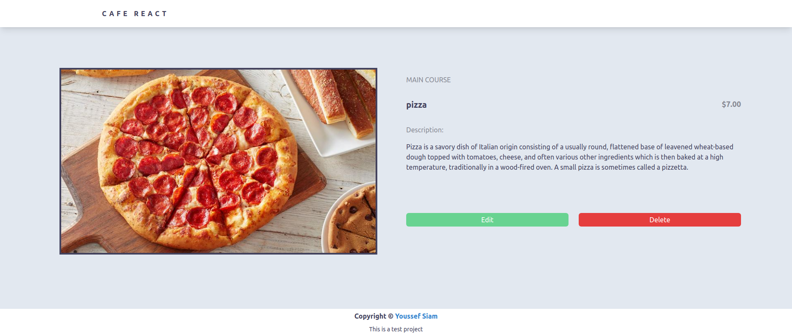

<h1>Cafe React</h1>

Cafe menu React app. It is a test project  
* Frontend-Framework: <a href="https://reactjs.org/" >React</a>
* UI-Framework: <a href="https://tailwindcss.com/" >Tailwindcss</a>
* Backend-Framework: <a href="https://expressjs.com/" >ExpressJS</a>
* Database: <a href="https://www.mysql.com/" >mysql</a>
<br>
<br>




<br>
<br>

<h1>How to setup the project</h1>

first you need mysql up and running on your machine, and let the creation of the database and the table to the <span style="color: red;" >server/cafe_react.sql</span> file you can run it like so

```bash
~/App$ mysql --protocol=tcp -u <YOUR DATABASE USER> -p
```
then
```bash
mysql> source server/cafe_react.sql
```

now, we are done with the database, then lets setup the client and server side. JUST by run

```bash
~/App$ cd server && npm i && cd ../client && npm i
```

change the name of the <span style="color: #9d4b2d" >server/example.env</span> file to <span style="color: #9d4b2d" >server/.env</span> and add the DB_PASS of your own Database

then
```bash
~/App/client$ npm run build
```
to generate an optmized build of the frontend.

Now, lets fire up our app..

```bash
~/App/server$ npm run start

~/App/server$ serve -s public -l 8080
```
> if the last command did not work for you, please run 
```bash
~/App/server$ npm i -g serve
```
<p>to install serve package globally (this package is the best to fire up a single page application that uses something like <span style="color: #3182ce;" >react-router</span>).</p>
<p>now I hope you can access the app in your browser by clicking <a href="http://localhost:8080" >here</a></p>

<br>
<br>

<h1>Test Requirments</h1>

- Using Git locally ☑
- Including README file ☑
- following the style of the design ☑
- Latest React version ☑
- Implementing the data store using GraphQL ☑
- Implement the basic 'menu list' and 'add menu item' form. ☑
- When a menu item is created, save it to the database. ☑
- When the browser is reloaded, load the menu list from the database. (and without reloading :smile: ) ☑
- Implement Edit and Delete buttons and functionality. ☑
- Implement the photo upload in the 'add menu item' form. ☑

<h2>Testing</h2>
My choice was the <a href="https://testing-library.com/" >testing library</a> to take advatage of its <a href="https://github.com/testing-library/user-event" >user event</a> module that can upload file to the form to fully test the UI, just run...

```bash
~/App/client$ npm test
```

<br>
<br>
<h1>More features</h1>

- This is a single page application, the browser don't refresh to go to other page
- The Menu Item page to view the description and the image with bigger size
- This application is fully responsive
